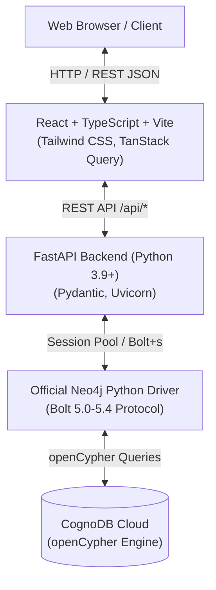

# SkillGraph — Graph-Based Job & Skill Discovery Platform

SkillGraph is an intelligent career discovery and skill gap analysis platform backed by **CognoDB**, a managed graph database speaking openCypher over Bolt.

---

## 1. Overview

SkillGraph transforms how candidates discover opportunities and how recruiters evaluate talent. Instead of keyword matching or flat relational lookups, SkillGraph models candidates, skills, jobs, roles, and companies as an interconnected property graph.

### Key Capabilities
- **Direct Skill Match Scoring**: Real-time calculation of match percentages based on required vs. candidate skills.
- **Multi-Hop Opportunity Discovery**: Uncovers jobs reachable through related skills (3-hop graph traversals) that traditional job boards miss.
- **Interactive Skill Gap Analysis**: Granular breakdown of possessed skills, missing skills, and prioritized areas to learn.
- **Skill Bridge Pathfinding**: Graph-native traversal uncovering the conceptual path connecting candidate competencies to target job requirements.
- **Role & Career Path Exploration**: Traverses candidate competencies to identify high-potential career directions.
- **Market Skill Demand**: Aggregated demand metrics highlighting top skills across companies and open positions.

---

## 2. Problem

Modern job search platforms suffer from fundamental limitations:
1. **Keyword Inflexibility**: If a job requires `FastAPI` and a candidate has `Python` and `REST APIs`, relational queries fail to identify the strong conceptual affinity.
2. **Opaque Skill Gaps**: Relational queries tell you *if* a match occurred, but cannot easily traverse transitive relationships (`Candidate → Python → ML → PyTorch → Job`) to explain *how* close a candidate is.
3. **Expensive Relational Traversal**: Computing multi-hop career paths in relational databases requires deeply nested `JOIN`s or recursive CTEs, degrading performance and increasing schema rigidity.

---

## 3. Why a Graph Database?

Graph databases treat **relationships as first-class citizens**. In SkillGraph, the most valuable insights are found in the connections between entities rather than isolated records.

```
(Candidate)-[:HAS_SKILL]->(Skill)-[:RELATED_TO]->(Skill)<-[:REQUIRES_SKILL]-(Job)
```

### Graph vs. Relational Comparison

| Capability | Relational Schema (PostgreSQL/MySQL) | Graph Database (CognoDB / Cypher) |
|---|---|---|
| **Data Representation** | Tables, Foreign Keys, Junction Tables (`candidate_skills`, `job_skills`, `skill_relations`) | Labeled Nodes (`:Candidate`, `:Skill`, `:Job`) and Typed Directed Edges (`:HAS_SKILL`, `:REQUIRES_SKILL`) |
| **Multi-Hop Traversal (e.g. 3+ hops)** | Multiple costly `JOIN`s or complex recursive CTEs (`WITH RECURSIVE`) | Declarative ASCII-art pattern matching: `(c)-[:HAS_SKILL]->(s)-[:RELATED_TO*1..2]->(rs)<-[:REQUIRES_SKILL]-(j)` |
| **Path Finding / Skill Bridges** | Requires application-level BFS/DFS logic or complex CTE self-joins | Native Cypher path expressions: `nodes(path)`, `length(path)` |
| **Schema Evolution** | `ALTER TABLE` migrations, new foreign keys, new nullable columns | Dynamic node properties and relationship types without breaking existing traversals |
| **Query Expressiveness** | 30+ line SQL queries with nested subqueries and aggregations | Concise 8-12 line Cypher patterns that mirror the domain mental model |

---

## 4. Architecture



- **Frontend**: React 19 + TypeScript + Vite + Tailwind CSS with TanStack React Query for reactive server-state management.
- **Backend**: Python + FastAPI structured with clear repository, service, schema, and routing layers.
- **Database**: CognoDB Cloud accessed over secure Bolt protocol using the official `neo4j` Python driver.

---

## 5. Graph Data Model

```mermaid
graph LR
    Candidate["Candidate<br/>• id, name, email<br/>• experience_years<br/>• location, bio"]
    Skill1["Skill<br/>• id, name<br/>• category, level"]
    Skill2["Skill (Related)<br/>• id, name<br/>• category, level"]
    Job["Job<br/>• id, title, description<br/>• experience_required<br/>• location, employment_type<br/>• salary_min, salary_max"]
    Role["Role<br/>• id, name"]
    Company["Company<br/>• id, name, industry<br/>• description, location"]
    Location["Location<br/>• id, city, country"]

    Candidate -->|HAS_SKILL<br/>{level, years}| Skill1
    Skill1 -->|RELATED_TO<br/>{strength}| Skill2
    Job -->|REQUIRES_SKILL<br/>{minimum_level, importance}| Skill1
    Job -->|FOR_ROLE| Role
    Job -->|AT_COMPANY| Company
    Job -->|LOCATED_IN| Location
    Company -->|LOCATED_IN| Location
```

### Node Types & Key Properties
- **`Candidate`**: `id`, `name`, `email`, `experience_years`, `location`, `bio`
- **`Skill`**: `id`, `name`, `category` (e.g. `Programming`, `AI/ML`, `DevOps`), `level`
- **`Job`**: `id`, `title`, `description`, `experience_required`, `location`, `employment_type`, `salary_min`, `salary_max`
- **`Company`**: `id`, `name`, `industry`, `description`, `location`
- **`Role`**: `id`, `name`
- **`Location`**: `id`, `city`, `country`

### Relationship Types & Properties
- `(Candidate)-[:HAS_SKILL {level, years}]->(Skill)`
- `(Skill)-[:RELATED_TO {strength}]->(Skill)`
- `(Job)-[:REQUIRES_SKILL {minimum_level, importance}]->(Skill)`
- `(Job)-[:FOR_ROLE]->(Role)`
- `(Job)-[:AT_COMPANY]->(Company)`
- `(Company)-[:LOCATED_IN]->(Location)`

---

## 6. Technology Stack

- **Database**: [CognoDB Cloud](https://console.cognodb.com) (openCypher over Bolt protocol)
- **Database Driver**: Official `neo4j` Python driver (`neo4j==5.27.0`)
- **Backend**: Python 3.9+, FastAPI, Uvicorn, Pydantic v2, python-dotenv
- **Frontend**: React 19, TypeScript, Vite, Tailwind CSS v4, TanStack Query, Lucide Icons
- **Testing**: pytest, pytest-asyncio, pytest-mock, httpx

---

## 7. Project Structure

```
WexaAI-Assignment/
├── backend/
│   ├── app/
│   │   ├── __init__.py
│   │   ├── main.py                  # FastAPI app configuration & CORS
│   │   ├── config.py                # Environment configuration (pydantic-settings)
│   │   ├── database.py              # Neo4j driver singleton & session management
│   │   ├── exceptions.py            # Domain exceptions (DatabaseUnavailable, NotFound)
│   │   ├── repositories/            # Parameterized Cypher query repositories
│   │   │   ├── candidate_repository.py
│   │   │   ├── job_repository.py
│   │   │   ├── skill_repository.py
│   │   │   ├── company_repository.py
│   │   │   └── graph_repository.py
│   │   ├── services/                # Business logic & response mapping
│   │   │   ├── candidate_service.py
│   │   │   ├── job_service.py
│   │   │   ├── skill_service.py
│   │   │   ├── company_service.py
│   │   │   └── graph_service.py
│   │   ├── routes/                  # REST API endpoints
│   │   │   ├── health.py
│   │   │   ├── candidates.py
│   │   │   ├── jobs.py
│   │   │   ├── skills.py
│   │   │   ├── companies.py
│   │   │   └── graph.py
│   │   └── schemas/                 # Pydantic response models
│   ├── cypher/                      # Documented Cypher queries
│   │   ├── 01_candidate_queries.cypher
│   │   ├── 02_job_matching.cypher
│   │   ├── 03_multi_hop_traversal.cypher
│   │   ├── 04_skill_gap_analysis.cypher
│   │   ├── 05_skill_demand.cypher
│   │   ├── 06_career_path.cypher
│   │   └── 07_graph_native_query.cypher
│   ├── seed/
│   │   └── seed.py                  # Idempotent seed script (MERGE operations)
│   ├── tests/                       # Pytest test suite
│   ├── requirements.txt
│   └── .env.example
├── frontend/
│   ├── src/
│   │   ├── components/              # Reusable UI components
│   │   │   ├── Layout.tsx
│   │   │   ├── SkillBadge.tsx
│   │   │   ├── MatchPercentageBar.tsx
│   │   │   ├── LoadingSpinner.tsx
│   │   │   ├── EmptyState.tsx
│   │   │   └── ErrorMessage.tsx
│   │   ├── pages/                   # Application views
│   │   │   ├── Dashboard.tsx
│   │   │   ├── CandidatesPage.tsx
│   │   │   ├── CandidateDetail.tsx  # Matching, Skill Gap, Bridge & Career Path
│   │   │   ├── JobsPage.tsx
│   │   │   ├── JobDetail.tsx
│   │   │   ├── SkillsPage.tsx       # Demand & Related Skills Traversal
│   │   │   ├── CompaniesPage.tsx
│   │   │   └── CompanyDetail.tsx
│   │   ├── services/api.ts          # Axios API client
│   │   ├── types/index.ts           # TypeScript interfaces
│   │   ├── App.tsx
│   │   └── main.tsx
│   ├── package.json
│   └── .env.example
├── docs/
│   └── screenshots/                 # UI screenshots
├── render.yaml                      # Render deployment descriptor
├── vercel.json                      # Vercel deployment descriptor
├── .gitignore
├── .env.example
└── README.md
```

---

## 8. Prerequisites

- **Python**: 3.9+
- **Node.js**: 18+ (tested on Node 24)
- **Git**: Installed
- **CognoDB Cloud Account**: Free account at [console.cognodb.com](https://console.cognodb.com)

---

## 9. Create CognoDB Cloud Instance

1. Go to [https://console.cognodb.com/signup](https://console.cognodb.com/signup) and create an account (no credit card required).
2. Click **Create Instance**, choose the free **c0** tier and select your preferred region.
3. Save your connection details:
   - **Connection URI**: `bolt+s://<instance-id>.databases.cognodb.cloud`
   - **Username**: `cognodb`
   - **Password**: Copy the generated password immediately.
4. Add these credentials to your `backend/.env` file.

---

## 10. Environment Variables

### Backend (`backend/.env`)
```bash
COGNODB_URI=bolt+s://your-instance-id.databases.cognodb.cloud
COGNODB_USERNAME=cognodb
COGNODB_PASSWORD=your-generated-password-here
CORS_ORIGINS=http://localhost:5173,http://localhost:3000
DEBUG=false
```

### Frontend (`frontend/.env`)
```bash
VITE_API_BASE_URL=http://localhost:8000
```

---

## 11. Local Setup Instructions

### 1. Clone the repository
```bash
git clone <your-repo-url>
cd WexaAI-Assignment
```

### 2. Backend Setup
```bash
cd backend
python -m venv venv

# Windows
.\venv\Scripts\activate
# macOS/Linux
# source venv/bin/activate

pip install -r requirements.txt
cp .env.example .env
# Edit .env with your CognoDB credentials
```

### 3. Seed Database
```bash
python seed/seed.py
```

### 4. Start Backend Server
```bash
uvicorn app.main:app --reload --port 8000
```
API Documentation available at: `http://localhost:8000/api/docs`

### 5. Frontend Setup (New Terminal)
```bash
cd frontend
npm install
npm run dev
```
Open `http://localhost:5173` in your browser.

---

## 12. Database Seeding

The seed script (`backend/seed/seed.py`) is fully idempotent using Cypher `MERGE` clauses and unique constraints:

```bash
python backend/seed/seed.py
```

### Seed Dataset Summary
- **10 Candidates** (with varied experience in ML, Full-Stack, Platform, Cloud, NLP)
- **38 Skills** across 10 categories (`Programming`, `AI/ML`, `DevOps`, `Cloud`, `Database`, `Backend`, `Frontend`, etc.)
- **48 Curated Skill Relationships** (`RELATED_TO` with realistic semantic strength)
- **16 Jobs** with structured skill requirements, minimum levels, and importance ratings
- **10 Companies** across various tech sectors
- **10 Roles** and **10 Locations**

---

## 13. API Endpoints

| Method | Endpoint | Description |
|---|---|---|
| `GET` | `/api/health` | Service & CognoDB connectivity health check |
| `GET` | `/api/candidates` | List all candidates |
| `GET` | `/api/candidates/{id}` | Candidate profile with possessed skills |
| `GET` | `/api/candidates/{id}/skills` | Candidate skill list with proficiency |
| `GET` | `/api/candidates/{id}/jobs` | Direct and multi-hop matching jobs |
| `GET` | `/api/candidates/{id}/skill-gaps/{job_id}` | Detailed skill gap analysis for a job |
| `GET` | `/api/candidates/{id}/roles` | Career directions connected to skills |
| `GET` | `/api/jobs` | List all open positions |
| `GET` | `/api/jobs/{id}` | Job details with required skills |
| `GET` | `/api/skills` | List all skills |
| `GET` | `/api/skills/demand` | Skills ranked by market demand |
| `GET` | `/api/skills/{id}/related` | Bounded traversal of related skills (1-3 hops) |
| `GET` | `/api/companies` | List all hiring companies |
| `GET` | `/api/companies/{id}` | Company details and active job openings |
| `GET` | `/api/graph/skill-bridge/{cand_id}/{job_id}` | Graph-native skill bridge paths |

---

## 14. Main Cypher Queries Explained

### Query 1: Direct Job Matching with Match Percentage
Calculates candidate match score for all jobs based on overlapping skills:
```cypher
MATCH (c:Candidate {id: $candidate_id})-[:HAS_SKILL]->(cs:Skill)
MATCH (j:Job)-[:REQUIRES_SKILL]->(rs:Skill)
MATCH (j)-[:AT_COMPANY]->(co:Company)
WITH j, co, c,
     collect(DISTINCT rs.id) AS required_skill_ids,
     collect(DISTINCT cs.id) AS candidate_skill_ids
WITH j, co,
     required_skill_ids,
     candidate_skill_ids,
     [s IN required_skill_ids WHERE s IN candidate_skill_ids] AS matched_ids
WHERE size(matched_ids) > 0
MATCH (ms:Skill) WHERE ms.id IN matched_ids
WITH j, co, required_skill_ids, matched_ids,
     collect(DISTINCT ms.name) AS matched_skill_names
RETURN j.id AS job_id, j.title AS title,
       co.name AS company_name,
       matched_skill_names AS matched_skills,
       size(required_skill_ids) AS total_required,
       size(matched_ids) AS match_count,
       round(100.0 * size(matched_ids) / size(required_skill_ids)) AS match_percentage
ORDER BY match_percentage DESC
LIMIT 20;
```

### Query 2: Multi-Hop Traversal (Candidate → HAS_SKILL → Skill → RELATED_TO → Skill → REQUIRES_SKILL ← Job)
Discovers opportunities that the candidate is qualified to learn or transition into:
```cypher
MATCH (c:Candidate {id: $candidate_id})-[:HAS_SKILL]->(directSkill:Skill)
MATCH (directSkill)-[:RELATED_TO*1..2]->(relatedSkill:Skill)
WHERE NOT (c)-[:HAS_SKILL]->(relatedSkill)
MATCH (j:Job)-[:REQUIRES_SKILL]->(relatedSkill)
MATCH (j)-[:AT_COMPANY]->(co:Company)
WITH c, j, co, collect(DISTINCT relatedSkill.name) AS bridgeSkills
WHERE NOT ANY(ds IN [(c)-[:HAS_SKILL]->(s) | s.id]
              WHERE (j)-[:REQUIRES_SKILL]->(:Skill {id: ds}))
RETURN j.id AS job_id, j.title AS title, co.name AS company_name,
       bridgeSkills AS matched_skills
ORDER BY size(bridgeSkills) DESC
LIMIT 10;
```

### Query 3: Skill Gap Analysis
Evaluates exactly what a candidate has vs. what is missing for a target job:
```cypher
MATCH (j:Job {id: $job_id})-[r:REQUIRES_SKILL]->(s:Skill)
MATCH (j)-[:AT_COMPANY]->(co:Company)
OPTIONAL MATCH (c:Candidate {id: $candidate_id})-[ch:HAS_SKILL]->(s)
WITH j, co, s, r, ch,
     ch IS NOT NULL AS has_skill
RETURN s.id AS skill_id, s.name AS skill_name, s.category AS category,
       r.minimum_level AS minimum_level, r.importance AS importance,
       has_skill, ch.level AS candidate_level
ORDER BY r.importance DESC, s.name;
```

### Query 4: Graph-Native Skill Bridge Path
Finds shortest conceptual bridge paths between possessed skills and required skills:
```cypher
MATCH (c:Candidate {id: $candidate_id})-[:HAS_SKILL]->(cs:Skill)
MATCH (j:Job {id: $job_id})-[:REQUIRES_SKILL]->(js:Skill)
WITH c, j, collect(DISTINCT cs) AS candidateSkills, collect(DISTINCT js) AS jobSkills
UNWIND candidateSkills AS cs
OPTIONAL MATCH path = (cs)-[:RELATED_TO*1..2]->(bridge:Skill)
WHERE bridge IN jobSkills
WITH cs, bridge, path,
     CASE WHEN path IS NOT NULL THEN length(path) ELSE 999 END AS distance
WHERE distance < 999
RETURN cs.name AS from_skill, bridge.name AS to_skill,
       distance AS hops,
       [n IN nodes(path) | n.name] AS path_names
ORDER BY distance, cs.name
LIMIT 20;
```

---

## 15. Error Handling & Resilience

- **Database Unreachable**: When CognoDB is unreachable or credentials are misconfigured, API endpoints return HTTP `503 Service Unavailable` with clean user-friendly JSON messages.
- **Frontend Feedback**: The UI displays contextual warning banners and retry suggestions without crashing or displaying stack traces.
- **Resource Not Found**: Standard HTTP `404 Not Found` responses when querying non-existent candidates, jobs, or companies.
- **Zero Information Leakage**: Secrets and database connection strings are never logged or returned in error payloads.

---

## 16. Testing

Run backend test suite:
```bash
cd backend
.\venv\Scripts\activate
python -m pytest tests/ -v
```

### Test Coverage
- `test_health.py`: Health endpoint under connected and degraded conditions.
- `test_candidates.py`: Candidate listing, single retrieval, 404 handling, and 503 database-down handling.
- `test_skills.py`: Skill listing, market demand queries, and related skill multi-hop responses.

---

## 17. Deployment Guide

### Backend Deployment (e.g. Render)
1. Push repository to GitHub.
2. Create a new **Web Service** on [Render](https://render.com).
3. Connect the repo and configure:
   - **Root Directory**: `backend`
   - **Build Command**: `pip install -r requirements.txt`
   - **Start Command**: `uvicorn app.main:app --host 0.0.0.0 --port $PORT`
4. Add Environment Variables:
   - `COGNODB_URI`: `bolt+s://<instance-id>.databases.cognodb.cloud`
   - `COGNODB_USERNAME`: `cognodb`
   - `COGNODB_PASSWORD`: `<your-password>`
   - `CORS_ORIGINS`: `https://<your-frontend>.vercel.app`

### Frontend Deployment (e.g. Vercel)
1. Import project in [Vercel](https://vercel.com).
2. Set **Root Directory** to `frontend`.
3. Add Environment Variable:
   - `VITE_API_BASE_URL`: `https://<your-render-backend-url>.onrender.com`
4. Deploy.

---

## 18. Live Demo

- **Hosted Demo URL**: `https://<your-deployed-app-url>.vercel.app` *(Optional/Encouraged)*
- **Screen Recording**: *(Place recording link here)*

---

## 19. UI Screenshots

*(Screenshots can be captured when running locally or against your deployed instance and saved in `docs/screenshots/`)*

1. **Dashboard View**: Platform overview, total stats, top demanded skills, and candidate list.
2. **Candidate Profile & Match Breakdown**: Selected candidate with calculated match percentages and skill gap visualization.
3. **Multi-Hop Skill Bridges**: Visual path linking existing skills to required job competencies.
4. **Skill Demand & Traversal**: Market demand bar charts and interactive related-skills tree.

---

## 20. Limitations & Future Improvements

- **Graph Visualization**: Integrate WebGL/Canvas-based force-directed graph viewer (such as Cytoscape.js or 3D Force Graph) for large node counts.
- **Weighted Match Scoring**: Incorporate experience years and skill proficiency level weights into the Cypher match formula.
- **Personalized Learning Paths**: Generate step-by-step curriculum recommendations based on shortest paths to dream roles.
